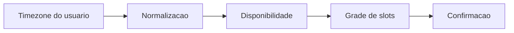

# Agenda Medica com Slots Dinamicos

**Nicho:** HealthTech & EdTech (Foco em UX/Acessibilidade)

## Contexto
Agenda de consulta com calendario, disponibilidade por profissional e selecao de slots em tempo real.

## Objetivo
Tornar a marcacao de horarios previsivel, acessivel e sem conflito de disponibilidade entre datas, profissionais e fusos.

## Requisitos de interface
- Calendario legivel com disponibilidade, bloqueios e slots ocupados claramente diferenciados.
- Navegacao rapida entre dia, semana e mes.
- Feedback imediato sobre conflitos, horario invalido ou ausencia de vagas.

## Requisitos tecnicos
- Usar `date-fns` e `date-fns-tz` para manipular datas e fusos com previsibilidade.
- Carregar disponibilidade por `TanStack Query` para manter cache e revalidacao leve.
- Apoiar-se em uma biblioteca de calendario ou grid customizado para slots.
- Normalizar tudo em timezone definido antes de renderizar.

## Diagrama Mermaid

## Regras de implementacao
- Bloquear slots invalidos com estados visuais e nao apenas com validacao tardia.
- Tratar horario de verao e mudancas de dia como casos de borda obrigatorios.
- Exibir a disponibilidade antes da acao de confirmacao.

## Stack recomendada
- `Next.js` para a estrutura da agenda.
- `React` para interacao e estados do calendario.
- `date-fns` e `date-fns-tz` para datas.
- `TanStack Query` para disponibilidade e cache.
- `react-hook-form` para filtros ou confirmacao de agendamento.
- `Tailwind CSS` para uma interface limpa e acessivel.

## Desafio tecnico
Manter a selecao de slots correta em diferentes fusos e com regras de disponibilidade dinamicas sem confundir o usuario.

## Justificativa tecnica
Ferramentas de agenda falham quando o timezone vira detalhe de implementacao. Separar a logica de data da apresentacao reduz bugs de horario e melhora a confianca na marcacao.

## Criterios de aceite
- O slot escolhido continua correto apos troca de timezone.
- Horarios ocupados aparecem bloqueados de forma explicita.
- A navegacao entre visoes do calendario e fluida.
- O fluxo funciona bem em desktop e mobile.
